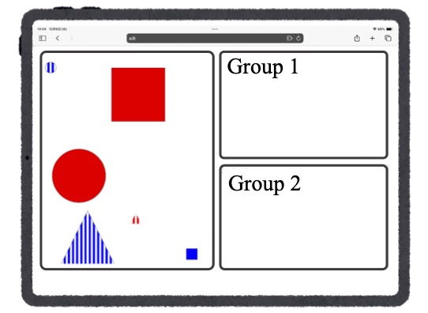

# Project Overview

This project is an interactive web application that allows users to move shapes. Users can navigate from the start page to practice or test pages, where they can perform drag-and-drop actions, random placement, and data recording.

## Page Structure

### Start Page
- **File**: `index.html`
- **Style**: `toppage_style.css`
- **Description**: The start page allows navigation to the practice or test pages.

### Practice Page
- **File**: `practice.html`
- **Style**: `practice.css`
- **Scripts**:
  - `practice.js`: Script for moving shapes.
  - `move_front.js`: Script to bring shapes to the front.
  - `random_place.js`: Script to randomly place shapes.
- **Description**: A page for practicing drag-and-drop actions with shapes.

### Test Page
- **File**: `thinking_test.html`
- **Style**: `thinking_test.css`
- **Scripts**:
  - `thinking_test_touch_test.js`: Records touch interaction data and exports it as a CSV file.
  - `drag_and_drop.js`: Enables drag-and-drop functionality for shapes.
  - `move_front.js`: Brings shapes to the front.
  - `random_place.js`: Randomly places shapes.
- **Description**: A page for performing the main shape-moving task.

## How to Use

1. Open `index.html` in a web browser.
2. Navigate to the "Practice" or "Test" page from the start page.
3. Perform drag-and-drop actions with shapes on the selected page.

## Key Features

- Drag-and-drop functionality for shapes
- Random placement of shapes
- Bringing shapes to the front
- Recording touch interaction data and exporting it as a CSV file

## License

This project was created by the University of Tokyo's Innovative Learning Creation Studies.